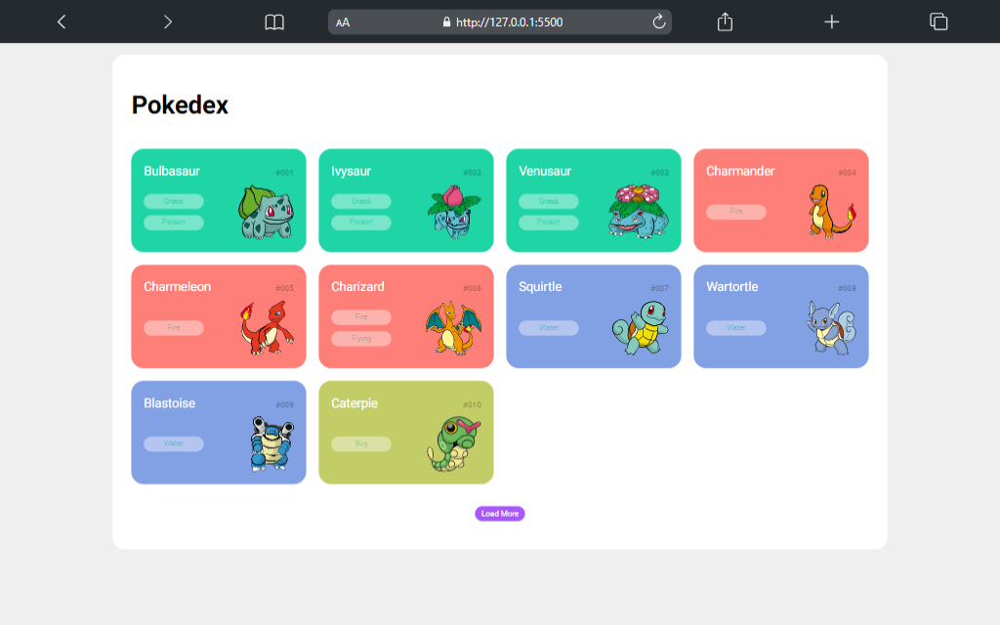

<h1>
  
  Pokedex (Listagem de Pokemon)
</h1>

# Introdução 🔥
Esse é um projeto desenvolvido de uma Pokedex durante o Bootcamp *Ri Happy - Front-end do Zero* da empresa DIO (Digital Innovation One). O projeto consiste em uma aplicação web que exibe informações sobre diferentes pokémons, permitindo aos usuários explorar suas características, tipos, habilidades e mais. Para executar o projeto, será necessário configurar um servidor HTTP local.

# Funcionalidades
Lista de Pokémons: A aplicação exibe uma lista de pokémons com suas imagens e nomes. Os pokémons são carregados a partir de uma fonte de dados externa.

Load More - Carregar Mais Tipos: Ao clicar no botão "Load More", mais tipos de pokémons serão carregados e exibidos na lista. Esta funcionalidade permite aos usuários explorar diferentes tipos de pokémons.

# Tecnologias Utilizadas 📦
- **HTML**: A estrutura básica da aplicação foi desenvolvida utilizando HTML.

- **CSS**: O estilo visual da aplicação foi implementado com CSS, garantindo um layout agradável e responsivo.

- **JavaScript**: A interatividade da aplicação foi construída com JavaScript. A manipulação do DOM permite atualizar as informações exibidas e melhorar a experiência do usuário.

- **Fonte de Dados**: As informações dos pokémons foram obtidas de uma API pública, que fornece detalhes como nome, número da pokédex, tipos, habilidades e imagens.

- **Live-Server**: Para executar o projeto, será necessário um servidor HTTP local. 

## Links 🔗
- [Link do deploy]()
- [Link do código]()

##  Autores 👷

- **Tatyane Gonçalve** - *Desenvolvedora* - [@tatyanepgoncalves](https://github.com/tatyanepgoncalves)
- **Renan J Paula** - *Software Engineer Lead e Tech Edutor* - [@RenanJPaula](https://github.com/RenanJPaula)